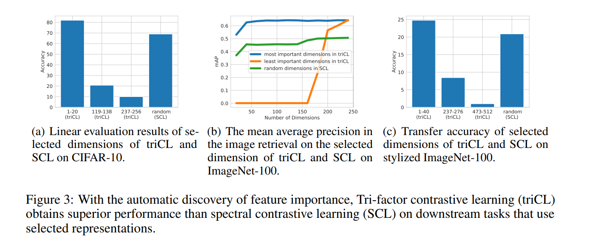

# Tri-factor Contrastive Learning（triCL)

This repository includes a PyTorch implementation of the NeurIPS 2023 paper [Identifiable Contrastive Learning with Automatic Feature Importance Discovery](https://openreview.net/forum?id=BQA7wR2KBF) authored by Qi Zhang*, [Yifei Wang*](https://yifeiwang77.github.io/), and [Yisen Wang](https://yisenwang.github.io/).

TriCL is a new self-supervised learning method that can obtain identifiable features that eliminate randomness and obtain more interpretable features that are ordered. As shown below, triCL is particularly helpful for downstream tasks when we select a subset of features according to the learned feature importance.



## Installation

First clone the repo.

Then use:
```
pip3 install .[dali,umap,h5] --extra-index-url https://developer.download.nvidia.com/compute/redist
```


## Training

Taking SimCLR on CIFAR-10 as an example, we pretrain the model with following commands
```bash
python3 main_pretrain.py \
    # path to training script folder
    --config-path scripts/pretrain/cifar/ \
    # training config name
    --config-name simclr.yaml

```
**NOTE:** We can change the argument (loss) in the scripts (e.g., scripts/pretrain/cifar/simclr.yaml) to pretrain the model with different methods (xent represents simclr, tri represents tri-SimCLR, spectral represents Spectral Contrastive Learning, spectral_tri represents tri-SCL).

After that, for offline linear evaluation on selected dimensions, follow the examples in `scripts/linear`.

---

## Citing this work
If you find the work useful, please cite the accompanying paper:
```
@inproceedings{
anonymous2023tricontrastive,
title={Tri-contrastive Learning: Identifiable Representation Learning with Automatic Discovery of Feature Importance},
author={Qi Zhang and Yifei Wang and Yisen Wang},
booktitle={NeurIPS},
year={2023},
}
```

## Acknowledgement

Our codes borrows the implementations of SimCLR in the solo-learn repository: https://github.com/vturrisi/solo-learn
